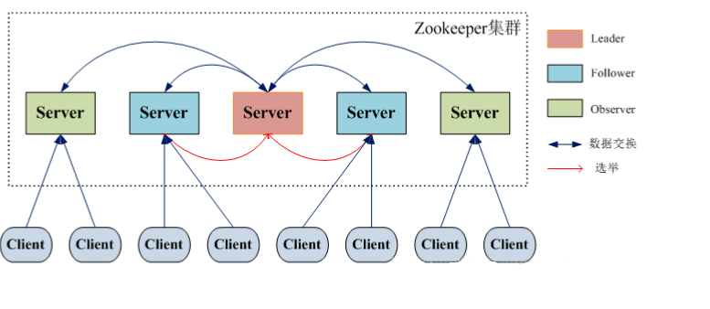

#一、ZooKeeper基础

## 1.1 为什么使用ZooKeeper？

1. Nginx作为负载均衡管理大量服务器时，管理起来比较麻烦，可以通过zookeeper注册服务与发现服务协作管理。

	 

	

2. 使用分布式部署后，多线程安全的问题，以前学的同步代码块、重构锁、读写锁等通通失效，怎么办？

3. 大数据分布式集群中，集群的服务器如何管理？

	

4. 以前大部分应用需要开发私有的协调程序，缺乏一个通用的机制协调程序的反复编写浪费，且难以形成通用、伸缩性好的协调器


## 1.2 ZooKeeper概述

### 1.2.1 ZooKeeper简介

ZooKeeper：动物园管理员

ZooKeeper是分布式应用程序的协调服务框架，是Hadoop的重要组件。ZooKeeper是Google的Chubby一个开源的实现，是Hadoop的分布式协调服务，包含一个简单的原语集，分布式应用程序可以基于它实现。

扩展：zk是根据Google的一篇论文

《The Chubby lock service for loosely coupled distributed systems》

### 1.2.2 具体应用场景

1. Hadoop,使用ZooKeeper的事件处理确保整个集群只有一个NameNode,存储配置信息等.

 

2. HBase,使用ZooKeeper的事件处理确保整个集群只有一个HMaster,察觉HRegionServer联机和宕机,存储访问控制列表等.

3. 分布式环境下的统一命名服务

 

4. 分布式环境下的配置管理

 

5. 数据发布/订阅

6. 分布式环境下的分布式锁

	

	

7. 集群管理问题

	

 


## 1.3 分布式编程容易出现的问题

分布式的思想就是人多干活快，即用多台机器同时处理一个任务。分布式的编程和单机的编程 思想是不同的，随之也带来新的问题和挑战。

1.活锁。活锁定义：在程序里，由于某些条件的发生碰撞，导致重新执行，再碰撞=》再执 行，如此循环往复，就形成了活锁。活锁的危害：多个线程争用一个资源，但是没有任何一个 线程能拿到这个资源。（死锁是有一个线程拿到资源，但相互等待互不释放造成死锁），活锁 是死锁的变种。补充：活锁更深层次的危害，很耗尽Cpu资源（在做无意义的调度)

2.需要考虑集群的管理问题，需要有一套机制来检测到集群里节点的状态变化。


3.如果用一台机器做集群管理，存在单点故障问题，所以针对集群管理，也需要形成一个集群

4.管理集群里Leader的选举问题（要根据一定的算法和规则来选举），包括要考虑Leader挂掉 之后，如何从剩余的follower里选出Leader

5.分布式锁的实现，用之前学的重入锁，同步代码块是做不了的

## 1.4 拜占庭将军问题

那么ZooKeeper最基础的东西是什么呢？不得不提Paxos，它是一个基于消息传递的一致性算法，Leslie Lamport（莱斯利·兰伯特）在1990年提出，近几年被广泛应用于分布式计算中，Google的Chubby，Apache的ZooKeeper都是基于它的理论来实现的，Paxos还被认为是到目前为止唯一的分布式一致性算法，其它的算法都是Paxos的改进或简化。有个问题要提一下，Paxos有一个前提：没有拜占庭将军问题。就是说Paxos只有在一个可信的计算环境中才能成立，这个环境是不会被入侵所破坏的。


##1.5 Paxos的小岛的故事

Paxos描述了这样一个场景，有一个叫做Paxos的小岛(Island)上面住了一批居民，岛上面所有的事情由一些特殊的人决定，他们叫做议员(Senator)。议员的总数(Senator Count)是确定的，不能更改。岛上每次环境事务的变更都需要通过一个提议(Proposal)，每个提议都有一个编号(PID)，这个编号是一直增长的，不能倒退。每个提议都需要超过半数((Senator Count/2)+1)的议员同意才能生效。每个议员只会同意大于当前编号的提议，包括已生效的和未生效的。如果议员收到小于等于当前编号的提议，他会拒绝，并告知对方：你的提议已经有人提过了。这里的当前编号是每个议员在自己记事本上面记录的编号，他不断更新这个编号。整个议会不能保证所有议员记事本上的编号总是相同的。现在议会有一个目标：保证所有的议员对于提议都能达成一致的看法。

好，现在议会开始运作，所有议员一开始记事本上面记录的编号都是0。有一个议员发了一个提议：将电费设定为1元/度。他首先看了一下记事本，嗯，当前提议编号是0，那么我的这个提议的编号就是1，于是他给所有议员发消息：1号提议，设定电费1元/度。其他议员收到消息以后查了一下记事本，哦，当前提议编号是0，这个提议可接受，于是他记录下这个提议并回复：我接受你的1号提议，同时他在记事本上记录：当前提议编号为1。发起提议的议员收到了超过半数的回复，立即给所有人发通知：1号提议生效！收到的议员会修改他的记事本，将1好提议由记录改成正式的法令，当有人问他电费为多少时，他会查看法令并告诉对方：1元/度。


现在看冲突的解决：假设总共有三个议员S1-S3，S1和S2同时发起了一个提议:1号提议，设定电费。S1想设为1元/度, S2想设为2元/度。结果S3先收到了S1的提议，于是他做了和前面同样的操作。紧接着他又收到了S2的提议，结果他一查记事本，咦，这个提议的编号小于等于我的当前编号1，于是他拒绝了这个提议：对不起，这个提议先前提过了。于是S2的提议被拒绝，S1正式发布了提议: 1号提议生效。S2向S1或者S3打听并更新了1号法令的内容，然后他可以选择继续发起2号提议。


好，我觉得Paxos的精华就这么多内容。现在让我们来对号入座，看看在ZK Server里面Paxos是如何得以贯彻实施的。

小岛(Island)——ZK Server Cluster

议员(Senator)——ZK Server

提议(Proposal)——ZNode Change(Create/Delete/SetData…)

提议编号(PID)——Zxid(ZooKeeper Transaction Id)

正式法令——所有ZNode及其数据

貌似关键的概念都能一一对应上，但是等一下，Paxos岛上的议员应该是人人平等的吧，而ZK Server好像有一个Leader的概念。没错，其实Leader的概念也应该属于Paxos范畴的。如果议员人人平等，在某种情况下会由于提议的冲突而产生一个“活锁”（所谓活锁我的理解是大家都没有死，都在动，但是一直解决不了冲突问题）。Paxos的作者Lamport在他的文章”The Part-Time Parliament“中阐述了这个问题并给出了解决方案——在所有议员中设立一个总统，只有总统有权发出提议，如果议员有自己的提议，必须发给总统并由总统来提出。

好，我们又多了一个角色：总统。

总统——ZK Server Leader

 

 

## 1.6 集群架构剖析

###1.6.1 ZooKeeper之攘其外

>  ZooKeeper服务端有两种不同的运行模式。单机的称为"**独立模式**"(standalone mode),但是独立模式存在单点故障的问题，所以在实际开发使用较少；集群的称为“**仲裁模式**(quorum mode)”，不存在单点故障的问题，实际开发中使用较多。


- 主从架构：Master + Slave

- 客户端读:   类比查询余额

- 客户端写：类比存钱


- leader在通知follower执行某条命令时，如何保障每个follower都收到，并执行呢？

	队列结构

	CAP：Consistency一致性；Availability可用性；Partition Tolerance分区容错；三选二


### 1.6.2 ZooKeeper之安其内

1. 思考一下这个架构有什么问题？


- leader很重要？如果挂了怎么办？开始选举新的leader

2. ZooKeeper服务器四种状态：

	- looking：服务器处于寻找Leader群首的状态

	- leading：服务器作为群首时的状态

	- following：服务器作为follower跟随者时的状态

	- observing：服务器作为观察者时的状态

> leader选举分**两种情况**
>
> - 集群初始启动时：安装后首次启动时
>
> - 集群运行中leader挂了时

3. **集群启动时的Leader选举**

	

	- 以3台机器组成的ZooKeeper集群为例 

	- 原则：集群中过半数Server启动后，才能选举出Leader；

	- 此处quorum数是多少？

	- 每个server投票信息**vote信息**结构为(sid, zxid)；

		​	server1~3初始投票信息分别为：

		​	server1 -> (1, 0)
		​	server2 -> (2, 0)
		​	server3 -> (3, 0)

	- **leader选举公式**：

		​	server1 (sid1, zxid1)

		​	server2 (sid2, zxid2)

		​	**zxid大的server胜出；若zxid相等，再根据判断sid判断，sid大的胜出**

	- 依次启动ZK1、ZK2、ZK3 选举的流程：

		- ZK1和ZK2票投给自己；ZK1的投票为(1, 0)，ZK2的投票为(2, 0)，并各自将投票信息分发给其他机器。 
		- 处理投票。每个server将收到的投票和自己的投票对比；ZK1更新自己的投票为(2, 0)，并将投票重新发送给ZK2。
		- 统计投票。server统计投票信息，是否有半数server投同一个服务器为leader；
		- 改变服务器状态。确定Leader后，各服务器更新自己的状态，Follower变为FOLLOWING；Leader变为LEADING。
		- 当ZK3启动时，发现已有Leader，不再选举，直接从LOOKING改为FOLLOWING。

	- 同时ZK1、ZK2、ZK3 选举的流程：

		- ZK1-> (1, 0) 	ZK2-> (2, 0)   ZK3 -> (3, 0) ->  ZK3被选中为Leader,其他两台节点被选为Follower。

4. 集群运行时新leader选举：

	

###1.6.3 脑裂和服务器数量选取

1. 服务器数量选取

	ZK集群的服务器的数量通常为奇数台（3,5,7,9）

	

2. 脑裂：

	

# 二、集群分布式安装

## 2.1 四台服务器之间免密登录

规划：需要三台服务器node2、node3、node4

首先将node1和node2拍摄快照，并还原到初始化快照上。

由于后续hadoop等需要四台服务器之间互相均可以免密登录，所以本次直接配置四台服务器的彼此之间的免密登录。配置思路如下：


a、 首先在四台服务器上都要执行：

```
ssh-keygen  -t  dsa  -P  ''  -f  ~/.ssh/id_dsa
```

b、在node1上将node1 的公钥拷贝到authorized_keys中：

```
cat ~/.ssh/id_dsa.pub  >>  ~/.ssh/authorized_keys
```

将该文件拷贝给node2：

```
scp ~/.ssh/authorized_keys  node2:/root/.ssh/
```

c、在node2中将node2的公钥追加到authorized_keys中：

```
cat ~/.ssh/id_dsa.pub  >>  ~/.ssh/authorized_keys
```

将该文件拷贝给node3：

```
scp ~/.ssh/authorized_keys  node3:/root/.ssh/
```

d、在node3中将node3的公钥追加到authorized_keys中：

```
cat ~/.ssh/id_dsa.pub  >>  ~/.ssh/authorized_keys
```

将该文件拷贝给node4：

```
scp ~/.ssh/authorized_keys  node4:/root/.ssh/
```

e、在node4中将node4的公钥追加到authorized_keys中：

```
cat ~/.ssh/id_dsa.pub  >>  ~/.ssh/authorized_keys
```

将该文件拷贝给node1、node2、node3：

```
scp ~/.ssh/authorized_keys  node1:/root/.ssh/
scp ~/.ssh/authorized_keys  node2:/root/.ssh/
scp ~/.ssh/authorized_keys  node3:/root/.ssh/
```

 f.测试是否实现了免密登录

```
ssh nodeX
exit # 退出
```

 

## 2.2 JDK安装和环境变量配置

node1-node4上目录的创建目录/opt/apps

```sh
mkdir /opt/apps
```

将jdk-8u221-linux-x64.rpm上传到node1/opt/apps

将/opt/apps下的jdk.rpm scp到node2、node3、node4的对应目录中

```sh
scp jdk-8u221-linux-x64.rpm node2:/opt/apps
scp jdk-8u221-linux-x64.rpm node3:/opt/apps
scp jdk-8u221-linux-x64.rpm node4:/opt/apps
```

在node1、node2、node3、node4上安装jdk并配置profile文件

```sh
rpm -ivh jdk-8u221-linux-x64.rpm
```

node1上修改环境变量

```sh
vim /etc/profile

export JAVA_HOME=/usr/java/default
export PATH=$PATH:$JAVA_HOME/bin

source /etc/profile
```

将node1的/etc/profile拷贝到node2、node3、node4上并执行 source  /etc/profile

```sh
scp /etc/profile node[234]:`pwd`
```

 

## 2.3 Zookeeper集群搭建

###2.3.1 下载地址

官网页面：https://zookeeper.apache.org


点击Download,进入下图所示的页面：


点击：[in the archive](https://archive.apache.org/dist/zookeeper/),进入如下界面


选择apache-zookeeper-3.5.7-bin.tar.gz 下载

最终网址：https://archive.apache.org/dist/zookeeper/zookeeper-3.5.7/apache-zookeeper-3.5.7-bin.tar.gz 

也可以在虚拟机中使用：

```sh
[root@node3 apps]# yum -y install wget
[root@node3 apps]# wget https://archive.apache.org/dist/zookeeper/zookeeper-3.5.7/apache-zookeeper-3.5.7-bin.tar.gz
```


###2.3.2 搭建步骤

**a)** 将apache-zookeeper-3.5.7-bin.tar.gz上传到node2

```sh
# 安装该包后，可以直接将文件拖到xshell，将文件上传到对应服务器
[root@node2 apps]# yum install lrzsz -y
```

**b)** 解压到/opt,并修改名称

```sh
[root@node2 apps]# tar -zxvf  apache-zookeeper-3.5.7-bin.tar.gz -C /opt
[root@node2 apps]# cd ../
[root@node2 opt]# mv apache-zookeeper-3.5.7-bin zookeeper-3.5.7
```

**c)** 配置环境变量：

```sh
[root@node2 zookeeper-3.5.7]# vim /etc/profile
export ZOOKEEPER_HOME=/opt/zookeeper-3.5.7
export PATH=$PATH:$JAVA_HOME/bin:$ZOOKEEPER_HOME/bin

#然后让配置生效
[root@node2 zookeeper-3.5.7]# source /etc/profile
#最后将该文件scp到node3和node4上，并分别让配置生效.
scp /etc/profile node3:/etc/
scp /etc/profile node4:/etc/
```

**d)** 到$ZooKeeper_HOME/conf下，复制zoo_sample.cfg为zoo.cfg

```sh
[root@node2 conf]# cp zoo_sample.cfg  zoo.cfg
```

**e)** 编辑zoo.cfg

补充：参数说明

```properties
tickTime=2000 #发送心跳的间隔时间，单位：毫秒
dataDir=/opt/zookeeper-3.5.7/data #ZooKeeper保存数据的目录
clientPort=2181
initLimit=5
syncLimit=2
server.2=node2:2881:3881
server.3=node3:2881:3881 
server.4=node4:2881:3881 #observer（表示对应节点不参与投票）
```


initLimit： 这个配置项是用来配置 ZooKeeper 接受客户端（这里所说的客户端不是用户连接ZooKeeper服务器的客户端，而是 ZooKeeper 服务器集群中连接到 Leader的Follower 服务器）初始化连接时最长能忍受多少个心跳时间间隔数。当已经超过 5 个心跳的时间（也就是 tickTime）长度后 ZooKeeper 服务器还没有收到客户端的返回信息，那么表明这个客户端连接失败。总的时间长度就是 5*2000=10秒

syncLimit：这个配置项标识 Leader 与 Follower 之间发送消息，请求和应答时间长度，最长不能超过多少个tickTime 的时间长度，总的时间长度就是 2*2000=4 秒

clientPort：客户端连接 ZooKeeper 服务器的端口，ZooKeeper 会监听这个端口，接受客户端的访问请求。

server.A=B：C：D：其 中 A 是一个数字，表示这个是第几号服务器；B 是这个服务器的ip地址；C 表示的是这个服务器与集群中的Leader服务器交换信息的端口；D表示的是万一集群中的 Leader 服务器挂了，需要一个端口来重新进行选举，选出一个新的Leader，而这个端口就是用来执行选举时服务器相互通信的端口。如果是伪集群的配置方式，由于B都是一样，所以不同的ZooKeeper实例通信端口号不能一样，所以要给它们分配不同的端口号。		

**f)** 创建/opt/zookeeper-3.5.7/data目录，并在该目录下放一个文件：myid

在myid中写下当前ZooKeeper的编号

```sh
[root@node2 ~]# mkdir /opt/zookeeper-3.5.7/data
[root@node2 data]# echo 2 > myid
```

**g)**将配置好ZooKeeper拷贝到node3、node4上

```sh
[root@node2 opt]# scp -r zookeeper-3.5.7/ node3:/opt/
[root@node2 opt]# scp -r zookeeper-3.5.7/ node4:/opt/
```

**h)** 在node3和node4上分别修改：myid

```sh
#node3
echo 3 > /opt/zooKeeper-3.5.7/data/myid
3
#node4
echo 4 > /opt/zooKeeper-3.5.7/data/myid
4 
```

###2.3.3 启动和关闭

**a)** 分别启动ZooKeeper

```
zkServer.sh start 
```

zkServer.sh start|stop|status

**b)** 关闭ZooKeeper

```
zkServer.sh stop
```

**c)** 连接ZooKeeper

```sh
#node2、node3、node4都可以
zkCli.sh   
```

**d)** 退出zkCli.sh命令

```
quit
```


# 三、ZooKeeper进阶

## 3.1 Znode数据结构

 

1. ZK有一个最开始的节点 /

2. ZK的节点叫做znode节点

3. 每个znode节点都可存储数据

4. 每个znode节点（临时节点除外）都可创建自己的子节点

5. 多个znode节点共同形成了znode树

6. Znode树的维系是在内存中，目的是供用户快速的查询。定期会做持久化，保存磁盘上，数据更加安全。

7. 每个znode节点都是一个路径（通过路径来定位这个节点）

8. 每个路径名都是唯一的。

### 3.1.1 目录结构

层次的，目录型结构，便于管理逻辑关系

znode信息

- 包含最大1MB的数据信息

- 记录了zxid等元数据信息


### 3.1.2 节点类型

znode有两种类型，临时的（ephemeral）和持久的（persistent）

znode支持序列SEQUENTIAL

**临时znode**

客户端会话结束时，ZooKeeper将该临时znode删除，临时znode没有子节点

**持久znode**

不依赖于客户端会话，只有当客户端明确要删除该持久znode时才会被删除，znode的类型在创建时确定并且之后不能再修改

 有序znode节点被分配唯一单调递增的整数。比如：客户端创建有序znode，路径为/task/task-，则ZooKeeper为其分配序号1，并追加到znode节点：/task/task-000000001。有序znode节点唯一，同时也可根据该序号查看znode创建顺序。


**znode有四种形式的目录节点**

- PERSISTENT：普通持久

- EPHEMERAL：普通临时

- PERSISTENT_SEQUENTIAL：顺序持久

- EPHEMERAL_SEQUENTIAL：顺序临时


要想执行以下指令，需要先启动zk服务器端，再启动zk客户端

./zkServer.sh start:启动zk服务器端

./zkCli.sh：启动zk客户端

## 3.2 客户端命令行操作

| 命令基本语法 | 功能描述                                                     |
| ------------ | ------------------------------------------------------------ |
| help         | 显示所有操作命令                                             |
| ls path      | 使用 ls 命令来查看当前znode的子节点<br />-w 监听子节点变化<br />-s  附加次级信息 |
| create       | 普通创建<br />-s  含有序列<br />-e  临时（重启或者超时消失） |
| get path     | 获得节点的值<br />-w 监听节点内容变化<br />-s  附加次级信息  |
| set          | 设置节点的具体值                                             |
| stat         | 查看节点状态                                                 |
| delete       | 删除节点                                                     |
| deleteall    | 递归删除节点                                                 |
| quit         | 退出客户端                                                   |

1. 启动三个节点上ZKServer，然后在某一个节点上启动一个客户端

	```sh
	#node2、node3、node4上同时执行命令
	zkServer.sh start
	#node2、node3、node4查看启动的状态
	zkServer.sh status
	#在node4上启动一个客户端
	[root@node4 ~]# zkCli.sh
	```

2. help显示所有的命令

	```sh
	[zk: localhost:2181(CONNECTED) 0] help
	ZooKeeper -server host:port cmd args
		addauth scheme auth
		close 
		config [-c] [-w] [-s]
		connect host:port
		create [-s] [-e] [-c] [-t ttl] path [data] [acl]
		delete [-v version] path
		deleteall path
		delquota [-n|-b] path
		get [-s] [-w] path
		getAcl [-s] path
		history 
		listquota path
		ls [-s] [-w] [-R] path
		ls2 path [watch]
		printwatches on|off
		quit 
		reconfig [-s] [-v version] [[-file path] | [-members serverID=host:port1:port2;port3[,...]*]] | [-add serverId=host:port1:port2;port3[,...]]* [-remove serverId[,...]*]
		redo cmdno
		removewatches path [-c|-d|-a] [-l]
		rmr path
		set [-s] [-v version] path data
		setAcl [-s] [-v version] [-R] path acl
		setquota -n|-b val path
		stat [-w] path
		sync path
	```

3. 查看指定节点下的所有内容

	```sh
	[zk: localhost:2181(CONNECTED) 1] ls /
	[zookeeper]
	```

4. 查看指定节点详细信息以及它的子节点

	```sh
	[zk: localhost:2181(CONNECTED) 2] ls2 /
	'ls2' has been deprecated. Please use 'ls [-s] path' instead.
	[zookeeper]
	cZxid = 0x0
	ctime = Thu Jan 01 08:00:00 CST 1970
	mZxid = 0x0
	mtime = Thu Jan 01 08:00:00 CST 1970
	pZxid = 0x0
	cversion = -1
	dataVersion = 0
	aclVersion = 0
	ephemeralOwner = 0x0
	dataLength = 0
	numChildren = 1
	[zk: localhost:2181(CONNECTED) 3] ls -s /
	[zookeeper] #表示 节点 /下的子节点
	#以下信息为节点/的详细信息
	cZxid = 0x0
	ctime = Thu Jan 01 08:00:00 CST 1970
	mZxid = 0x0
	mtime = Thu Jan 01 08:00:00 CST 1970
	pZxid = 0x0
	cversion = -1
	dataVersion = 0
	aclVersion = 0
	ephemeralOwner = 0x0
	dataLength = 0
	numChildren = 1
	```

5. 监听查看，创建节点

	```sh
	#node4
	[zk: localhost:2181(CONNECTED) 4] ls -w /
	[zookeeper]
	#node3
	[zk: localhost:2181(CONNECTED) 0] create /wzyy "phone game"
	Created /wzyy
	#node4上的变化
	[zk: localhost:2181(CONNECTED) 5] 
	WATCHER::
	
	WatchedEvent state:SyncConnected type:NodeChildrenChanged path:/
	```

6. 获取节点信息

	```sh
	[zk: localhost:2181(CONNECTED) 4] get /wzyy
	phone game
	```

7. 获取节点的详细信息

	```sh
	[zk: localhost:2181(CONNECTED) 5] get -s /wzyy
	phone game #节点中保存的数据，可以保存1MB的数据
	cZxid = 0x300000005 #创建事务id。3(它是0000 0003省略表示方式)表示Leader改变过三次。
	ctime = Mon Sep 13 09:42:19 CST 2021 #该节点的创建时间
	mZxid = 0x300000005 #修改的事务id，创建后没有被修改过，使用创建时的事务id
	mtime = Mon Sep 13 09:42:19 CST 2021 #修改此节点的时间，没有被修改过，使用时创建的时间
	pZxid = 0x300000005 #记录子级节点的最大事务id
	cversion = 0
	dataVersion = 0 #数据的版本号，每改一次该节点的数据，版本号加1
	aclVersion = 0
	ephemeralOwner = 0x0 #该节点对应的session的id
	dataLength = 10 #节点中数据的长度
	numChildren = 0 #该节点下子级节点的数量
	```

8. 创建普通临时节点

	```sh
	#创建临时节点
	[zk: localhost:2181(CONNECTED) 14] create -e /wzyy/test 'qqq'
	Created /wzyy/test
	[zk: localhost:2181(CONNECTED) 15] ls /wzyy
	[fashi, sheshou, test]
	[zk: localhost:2181(CONNECTED) 15] quit
	[root@node3 ~]# zkCli.sh
	[zk: localhost:2181(CONNECTED) 15] ls /wzyy
	[fashi, sheshou] #发现子节点test小时
	```

9. 创建顺序节点

	```sh
	#创建普通顺序节点
	[zk: localhost:2181(CONNECTED) 1] create -s /wzyy/zhanshi 'putongshunxu'
	Created /wzyy/zhanshi0000000003
	[zk: localhost:2181(CONNECTED) 2] create -s /wzyy/zhanshi 'putongshunxu2'
	Created /wzyy/zhanshi0000000004
	[zk: localhost:2181(CONNECTED) 3] ls /wzyy
	[fashi, sheshou, zhanshi0000000003, zhanshi0000000004]
	#创建临时顺序节点
	[zk: localhost:2181(CONNECTED) 4] create -s -e /wzyy/tanke 'se1'
	Created /wzyy/tanke0000000005
	```

10. 修改节点的值

	```sh
	[zk: localhost:2181(CONNECTED) 10] get /wzyy/fashi
	yuancheng
	[zk: localhost:2181(CONNECTED) 11] set /wzyy/fashi "yuancheng_edit"
	[zk: localhost:2181(CONNECTED) 12] get /wzyy/fashi
	yuancheng_edit
	```

11. 监控节点值的变化

	```sh
	#node4
	[zk: localhost:2181(CONNECTED) 6] get -w /wzyy/fashi
	yuancheng_edit
	#node3上
	[zk: localhost:2181(CONNECTED) 13] set /wzyy/fashi "yuancheng_update"
	#node4
	[zk: localhost:2181(CONNECTED) 7] 
	WATCHER::
	
	WatchedEvent state:SyncConnected type:NodeDataChanged path:/wzyy/fashi
	```

12. 删除节点

	```sh
	[zk: localhost:2181(CONNECTED) 14] ls /wzyy
	[fashi, sheshou, tanke0000000005, zhanshi0000000003, zhanshi0000000004]
	[zk: localhost:2181(CONNECTED) 15] delete /wzyy/zhanshi0000000004
	[zk: localhost:2181(CONNECTED) 16] ls /wzyy
	[fashi, sheshou, tanke0000000005, zhanshi0000000003]
	```

13. 递归删除

	```sh
	[zk: localhost:2181(CONNECTED) 18] ls /wzyy/fashi
	[wangzhaojun]
	[zk: localhost:2181(CONNECTED) 19] delete /wzyy/fashi
	Node not empty: /wzyy/fashi
	[zk: localhost:2181(CONNECTED) 20] rmr /wzyy/fashi #deleteall /wzyy/fashi
	#建议使用deleteall进行递归删除
	The command 'rmr' has been deprecated. Please use 'deleteall' instead.
	[zk: localhost:2181(CONNECTED) 21] ls /wzyy
	[sheshou, tanke0000000005, zhanshi0000000003]
	```

14. 查看节点的状态

	```sh
	[zk: localhost:2181(CONNECTED) 22] stat /wzyy
	cZxid = 0x300000005
	ctime = Mon Sep 13 09:42:19 CST 2021
	mZxid = 0x300000005
	mtime = Mon Sep 13 09:42:19 CST 2021
	pZxid = 0x300000015
	cversion = 9
	dataVersion = 0
	aclVersion = 0
	ephemeralOwner = 0x0
	dataLength = 10
	numChildren = 3
	```

 

## 3.3 会话(Session)



**定义：**客户端通过TCP协议与独立服务器或者一个集群中的某个服务器建立TCP长连接。

**特点：**

1. 会话提供顺序保障，即同一个会话中的请求以FIFO的顺序执行。如果客户端有多个并发会话，FIFO顺序在多个会话之间未必能够保持。

	

2. 如果连接的Server出现问题，在没有超过Timeout时间时，可以连接其它节点。ZooKeeper客户端透明地转移一个会话到不同的服务器。

3. 同一session期内的特性不变

4. 当一个会话因某种原因终止，在这个会话期间创建的临时节点将会消失。


 **生命周期：**


**Session是由谁来创建的？**

Leader：产生一个唯一的session，放到消息队列，让所有server知道

过半机制：保证session创建成功或者失败

 

## 3.4 事件监听原理剖析

问题：客户端如何获取Zookeeper服务器上最新数据？

**方式一：**客户端轮询指定节点下的数据，通过网络轮询，代价很大。

 

 

**方式二：**基于通知（notification）的机制：

客户端向ZooKeeper注册需要接收通知的znode，通过对znode设置监视点（watch）来接收通知。监视点是一个单次触发的操作，意即监视点会触发一个通知。 

 

 对比两种方式，哪种方式好？


**事件监听Watcher**

Watcher 在 ZooKeeper 是一个核心功能，Watcher 可以监控目录节点的数据变化以及子节点的变化，一旦这些状态发生变化，服务器就会通知所有设置在这个目录节点上的Watcher，从而每个客户端都很快知道它所关注的目录节点的状态发生变化，而做出相应的反应。

JavaAPI:

- 可以设置观察点的操作：exists,getChildren,getData

- 可以触发观察的操作：create,delete,setData

	


## 3.5 工作原理

ZooKeeper的核心是原子广播，这个机制保证了各个server之间的信息同步。实现这个机制的协议叫做ZAB协议。

**ZAB协议有两种模式：**

1.恢复模式：当服务启动或者在领导者崩溃后，ZAB就进入了恢复模式。当领导者被选举出来，且大多数server的完成了和leader的状态同步以后，恢复模式就结束了。状态同步保证了leader和follower以及observer具有相同的系统状态。

完成leader选举后，zk就进入ZooKeeper之间状态同步过程

1. leader等待server连接；
2. Follower连接leader，将最大的zxid发送给leader；
3. Leader根据follower的zxid确定同步点；
4. 完成同步后通知follower 已经成为uptodate状态；
5. Follower收到uptodate消息后，又可以重新接受client的请求进行服务了。


2.广播模式

广播模式需要保证proposal被按顺序处理，因此zk采用了递增的事务id号(zxid)来保证。所有的提议(proposal)都在被提出的时候加上了zxid(比如：0x1000000300000002)。

epoch也称为纪元数字。实现中zxid是一个64位的数字，它高32位是epoch用来标识leader关系是否改变，每次一个leader被选出来，它都会有一个新的epoch，低32位是个递增计数。

 

1. 在Client向Follwer发出一个写的请求
2. Follwer把请求发送给Leader
3. Leader接收到以后开始发起投票并通知Follwer进行投票
4. Follwer把投票结果发送给Leader
5. Leader将结果汇总后如果需要写入，则开始写入同时把写入操作通知给Follwer，然后commit
6. Follwer把请求结果返回给Client

## 3.6 Zookeeper集群的特点

 

 

 

# 四、ZK API实战

## 4.1 IDEA环境搭建

1. 创建一个Maven工程zookeeper

2. 添加pom文件

	```xml
	<?xml version="1.0" encoding="UTF-8"?>
	<project xmlns="http://maven.apache.org/POM/4.0.0"
	         xmlns:xsi="http://www.w3.org/2001/XMLSchema-instance"
	         xsi:schemaLocation="http://maven.apache.org/POM/4.0.0 http://maven.apache.org/xsd/maven-4.0.0.xsd">
	    <modelVersion>4.0.0</modelVersion>
	    <groupId>com.itbaizhan</groupId>
	    <artifactId>zookeeper</artifactId>
	    <version>1.0-SNAPSHOT</version>
	    <properties>
	        <maven.compiler.source>1.8</maven.compiler.source>
	        <maven.compiler.target>1.8</maven.compiler.target>
	    </properties>
	    <dependencies>
	        <dependency>
	            <groupId>junit</groupId>
	            <artifactId>junit</artifactId>
	            <version>4.11</version>
	            <scope>test</scope>
	        </dependency>
	        <dependency>
	            <groupId>org.apache.logging.log4j</groupId>
	            <artifactId>log4j-core</artifactId>
	            <version>2.8.2</version>
	        </dependency>
	        <!-- https://mvnrepository.com/artifact/org.apache.zookeeper/zookeeper -->
	        <dependency>
	            <groupId>org.apache.zookeeper</groupId>
	            <artifactId>zookeeper</artifactId>
	            <version>3.5.7</version>
	        </dependency>
	    </dependencies>
	</project>
	```

3. 需要在项目的src/main/resources目录下，新建一个文件，命名为“log4j.properties”，在文件中填入。

	```properties
	log4j.rootLogger=INFO,stdout,logfile
	log4j.appender.stdout=org.apache.log4j.ConsoleAppender
	log4j.appender.stdout.layout=org.apache.log4j.PatternLayout
	log4j.appender.stdout.layout.ConversionPattern=%d %p [%c] - %m%n
	log4j.appender.logfile=org.apache.log4j.FileAppender
	log4j.appender.logfile.File=target/zk.log
	log4j.appender.logfile.layout=org.apache.log4j.PatternLayout
	log4j.appender.logfile.layout.ConversionPattern=%d %p [%c] - %m%n
	```


## 4.2 创建ZooKeeper客户端

```java
package com.itbaizhan.zookeeper.curd;

import org.apache.log4j.Logger;
import org.apache.zookeeper.WatchedEvent;
import org.apache.zookeeper.Watcher;
import org.apache.zookeeper.ZooKeeper;
import org.junit.After;
import org.junit.Before;
import org.junit.Test;
import java.io.IOException;

public class ZKCurd {
    //定义会话的超时时间
    private final static int SESSION_TIME=30000;
    //定义zk集群的ip地址
    private final static String ZK_SERVERS = "192.168.20.102:2181,192.168.20.103:2181,192.168.20.104:2181";
    //日志对象
    private final static Logger LOGGER = Logger.getLogger(ZKCurd.class);
    private ZooKeeper zkCli = null;
    private Watcher watcher = new Watcher() {
        @Override
        public void process(WatchedEvent watchedEvent) {
            LOGGER.info("event:"+watchedEvent.toString());
        }
    };
    @Before
    public void connect() throws IOException {
        zkCli = new ZooKeeper(ZK_SERVERS,SESSION_TIME,watcher);
        //获取当前会话的sessionId
        long sessionId = zkCli.getSessionId();
        LOGGER.info("sessionId:"+sessionId);
        System.out.println("zkCli:"+zkCli);
    }
    @After
    public void close() throws InterruptedException {
        zkCli.close();
    }
}
```


## 4.3 创建节点

```java
/**创建节点
 *final String path:要创建节点的全路径
 * byte data[]:节点中数据内容
 * List<ACL> acl：节点权限
 * CreateMode createMode:节点类型
     * PERSISTENT:普通持久节点
     * PERSISTENT_SEQUENTIAL：顺序持久节点
     * EPHEMERAL：普通临时节点
     * EPHEMERAL_SEQUENTIAL：顺序临时节点
 */
@Test
public void create(){
    String result = "";
    try {
        /*result = zkCli.create("/itbaizhan", "good".getBytes(),
                ZooDefs.Ids.OPEN_ACL_UNSAFE, CreateMode.PERSISTENT);*/
        result = zkCli.create("/zk002", "good".getBytes(),
                ZooDefs.Ids.OPEN_ACL_UNSAFE, CreateMode.EPHEMERAL);
    } catch (Exception e) {
        LOGGER.error(e.getMessage());
        //抛出AssertionError
        Assert.fail();
    }
    LOGGER.info("create result:{"+result+"}");
}
```

##4.4 判断节点是否存在

```java
@Test
public void exists(){
    try {
        Stat stat = zkCli.exists("/bjsxt", false);
        if(stat==null){
            System.out.println("/bjsxt not exists");
        }else{
            System.out.println("/bjsxt exists");
        }
    } catch (Exception e) {
        LOGGER.error(e.getMessage());
    }
}
```


##4.5查询节点值和状态信息

```java
@Test
public void getData(){
    String result = null;
    try {
        byte[] data = zkCli.getData("/itbaizhan", null, null);
        result = new String(data);
    } catch (KeeperException e) {
        LOGGER.error(e.getMessage());
    } catch (InterruptedException e) {
        LOGGER.error(e.getMessage());
    }
    LOGGER.info("getData result------{"+result+"}");
}
@Test
public void getDataStat(){
    String result = null;
    Stat stat = new Stat();
    try {
        byte[] data = zkCli.getData("/itbaizhan", null, stat);
        result = new String(data);
    } catch (KeeperException e) {
        LOGGER.error(e.getMessage());
    } catch (InterruptedException e) {
        LOGGER.error(e.getMessage());
    }
    LOGGER.info("getData result------{"+result+"}");
    LOGGER.info("getData stat------{"+stat+"}");
}
```

## 4.6 获取子节点信息

```java
//获取子节点的名称
@Test
public void getChildren(){
    try {
        List<String> childrenList = zkCli.getChildren("/", true);
        //遍历子节点
        for(String child:childrenList){
            LOGGER.info("child:{"+child+"}");
        }
    } catch (KeeperException e) {
        LOGGER.error(e.getMessage());
    } catch (InterruptedException e) {
        LOGGER.error(e.getMessage());
    }
}
//获取子节点的数据
@Test
public void getChildrenData(){
    try {
        List<String> childrenList = zkCli.getChildren("/", true);
        String data = null;
        //遍历子节点
        for(String child:childrenList){
            data = new String(zkCli.getData("/" + child, null, null));
            LOGGER.info("child:{"+child+"},value:{"+data+"}");
        }
    } catch (KeeperException e) {
        LOGGER.error(e.getMessage());
    } catch (InterruptedException e) {
        LOGGER.error(e.getMessage());
    }
}
```


##4.7 修改节点值

```java
@Test
public void setData(){
    Stat stat = null;
    try {
        //path：被修改节点的全路径，第二个参数：修改后的value，version：-1表示不管version的值为几都可以修改
        stat = zkCli.setData("/zk001","setData01".getBytes(),-1);
    } catch (KeeperException e) {
        LOGGER.error(e.getMessage());
    } catch (InterruptedException e) {
        LOGGER.error(e.getMessage());
    }
    //dataVersion:getVersion获取是getVersion，代表节点值的版本，每被修改一次该值加1
    LOGGER.info("version:{"+stat.getVersion()+"}");
}
```

## 4.8 删除节点

```java
@Test
public void delete(){
    try {
        zkCli.delete("/wzyy/zhanshi0000000003",-1);
    } catch (InterruptedException e) {
        LOGGER.error(e.getMessage());
    } catch (KeeperException e) {
        LOGGER.error(e.getMessage());
    }
}
```

##4.9 验证注册事件被触发的一次性

```java
@Test
public void getDataWatcher(){
    String result = null;
    System.out.println("get:");
    try {
        byte[] data = zkCli.getData("/zk001", new Watcher() {
            @Override
            public void process(WatchedEvent event) {
                LOGGER.info("getDataWatcher event type:{" + event.getType() + "}");
                System.out.println("watcher ok!!");
            }
        }, null);
        result = new String(data);
    } catch (KeeperException e) {
        LOGGER.error(e.getMessage());
        Assert.fail();
    } catch (InterruptedException e) {
        LOGGER.error(e.getMessage());
        Assert.fail();
    }
    LOGGER.info("getData result:{"+result+"}");
    //修改节点值
    try {
        System.out.println("-------set1------");
        zkCli.setData("/zk001","update1".getBytes(),-1);
        System.out.println("-------set2------");
        zkCli.setData("/zk001","update2".getBytes(),-1);
    } catch (Exception e) {
        LOGGER.error(e.getMessage());
        Assert.fail();
    }
    System.out.println("test over");
    try {
        Thread.sleep(30000);
    } catch (InterruptedException e) {
        LOGGER.error(e.getMessage());
    }
}
```

注册Watcher，查询注册watch，增删改触发watcher

如果是多次增删改，回调方法调用几次？

1、watcher事件是一次性的

2、是增删改触发watcher，但是watcher是线程异步执行

3、watcher可以反复注册

如何平滑反复注册？在回调方法中迭代调用即可。

 

# 五、分布式协调案例

如何实现“跨虚拟机”的调用，它就是 RMI（Remote Method Invocation，远程方法调用）。例如，服务A 在 JVM1 中运行，服务B 在 JVM2 中运行，服务A 与 服务B 可相互进行远程调用，就像调用本地方法一样，这就是 RMI。在分布式系统中，我们使用 RMI 技术可轻松将 服务提供者（Service Provider）与 服务消费者（Service Consumer）进行分离，充分体现组件之间的弱耦合，系统架构更易于扩展。

 

我们先从通过一个最简单的 RMI 服务与调用示例，快速掌握 RMI 的使用方法，然后指出 RMI 的局限性，最后笔者对此问题提供了一种简单的解决方案，即使用 ZooKeeper 轻松解决 RMI 调用过程中所涉及的问题。

下面我们就从一个最简单的 RMI 示例开始吧！

## 5.1 Java原生RMI实现

 

### 5.1.1 发布 RMI 服务

发布一个 RMI 服务，我们只需做三件事情：

1. 定义一个 RMI 接口:HelloService

2. 编写 RMI 接口的实现类:HelloServiceImpl

3. 通过 JNDI 发布 RMI 服务

### 5.1.2 定义一个 RMI 接口

RMI 接口实际上还是一个普通的 Java 接口，只是 RMI 接口必须继承 java.rmi.Remote，此外，每个 RMI 接口的方法必须声明抛出一个 java.rmi.RemoteException 异常，就像下面这样：

```java
package com.itbaizhan.zookeeper.rmi.common;
import java.rmi.Remote;
import java.rmi.RemoteException;
public interface HelloService extends Remote {
  String sayHello(String name) throws RemoteException;
}
```

继承了 Remote 接口，实际上是让 JVM 得知该接口是需要用于远程调用的，抛出了 RemoteException 是为了让调用 RMI 服务的程序捕获这个异常。毕竟远程调用过程中，什么奇怪的事情都会发生（比如：断网）。需要说明的是，RemoteException 是一个“受检异常”，在调用的时候必须使用 try...catch... 自行处理。

 

### 5.1.3 编写 RMI 接口的实现类

实现以上的 HelloService 是一件非常简单的事情，但需要注意的是，我们必须让实现类继承 java.rmi.server.UnicastRemoteObject 类，此外，必须提供一个构造器，并且构造器必须抛出 java.rmi.RemoteException 异常。我们既然使用 JVM 提供的这套 RMI 框架，那么就必须按照这个要求来实现，否则是无法成功发布 RMI 服务的，一句话：我们得按规矩出牌！

```java
package com.itbaizhan.zookeeper.rmi.server;
import com.itbaizhan.zookeeper.rmi.common.HelloService;
import java.rmi.RemoteException;
import java.rmi.server.UnicastRemoteObject;

public class HelloServiceImpl extends UnicastRemoteObject implements HelloService {
    //添加构造方法
    protected HelloServiceImpl() throws RemoteException {
    }
    @Override
    public String sayHello(String name) throws RemoteException {
        //return "Hello "+name+"!";
        return String.format("Hello %s !",name);
    }
}
```

为了满足 RMI 框架的要求，我们确实做了很多额外的工作（继承了 UnicastRemoteObject 类，抛出了 RemoteException 异常），但这些工作阻止不了我们发布 RMI 服务的决心！我们可以通过 JVM 提供的 JNDI（Java Naming and Directory Interface，Java 命名与目录接口）这个 API 轻松发布 RMI 服务。

 

### 5.1.4 通过 JNDI 发布 RMI 服务

发布 RMI 服务，我们需要告诉 JNDI 三个基本信息：

1. 域名或 IP 地址（host）

2. 端口号（port）

3. 服务名（service）

它们构成了 RMI 协议的 URL（或称为“RMI 地址”）：

rmi://<host>:<port>/<service>

如果我们是在本地发布 RMI 服务，那么 host 就是“localhost”。此外，RMI 默认的 port 是“1099”，我们也可以自行设置 port 的值（只要不与其它端口冲突即可）。service 实际上是一个基于同一 host 与 port 下唯一的服务名，我们不妨使用 Java 完全类名来表示吧，这样也比较容易保证 RMI 地址的唯一性。

 对于我们的示例而言，RMI 地址为：

rmi://localhost:1099/com.itbaizhan.zookeeper.rmi.server.HelloServiceImpl

我们只需简单提供一个 main() 方法就能发布 RMI 服务，就像下面这样：

```java
package com.itbaizhan.zookeeper.rmi.server;

import java.rmi.Naming;
import java.rmi.RemoteException;
import java.rmi.registry.LocateRegistry;

public class RmiServer {
    public static void main(String[] args) throws Exception {
        System.out.println("rmi server running...");
        //定义发布RMI服务时使用的端口
        int port = 1099;
        //定义url
        String url = "rmi://localhost:1099/com.itbaizhan.zookeeper.rmi.server.HelloServiceImpl";
        //注册服务:在JNDI中创建了一个注册表
        LocateRegistry.createRegistry(port);
        //绑定服务：将RMI服务的实现类对象与url绑定
        Naming.rebind(url,new HelloServiceImpl());
    }
}
```

需要注意的是，我们通过 LocateRegistry.createRegistry() 方法在 JNDI 中创建一个注册表，只需提供一个 RMI 端口号即可。此外，通过 Naming.rebind() 方法绑定 RMI 地址与 RMI 服务实现类，这里使用了 rebind() 方法，它相当于先后调用 Naming 的 unbind() 与 bind() 方法，只是使用 rebind() 方法来得更加痛快而已，所以我们选择了它。

运行这个 main() 方法，RMI 服务就会自动发布，剩下要做的就是写一个 RMI 客户端来调用已发布的 RMI 服务。

 

### 5.1.5 调用 RMI 服务

同样我们也使用一个 main() 方法来调用 RMI 服务，相比发布而言，调用会更加简单，我们只需要知道两个东西：1. RMI 请求路径、2. RMI 接口（一定不需要 RMI 实现类，否则就是本地调用了）。数行代码就能调用刚才发布的 RMI 服务，就像下面这样：

```java
package com.itbaizhan.zookeeper.rmi.client;

import com.itbaizhan.zookeeper.rmi.common.HelloService;
import java.net.MalformedURLException;
import java.rmi.Naming;
import java.rmi.NotBoundException;
import java.rmi.Remote;
import java.rmi.RemoteException;

public class RmiClient {
    public static void main(String[] args) throws MalformedURLException, NotBoundException, RemoteException {
        System.out.println("rmi client running");
        //定义url
        String url = "rmi://localhost:1099/com.itbaizhan.zookeeper.rmi.server.HelloServiceImpl";
        //找寻发布的服务，并返回对象
        Remote lookup = Naming.lookup(url);
        //强制类型转换
        HelloService helloService = (HelloService)lookup;
        //调用方法
        String result = helloService.sayHello("gtjin");
        System.out.println("client result:"+result);
    }

}
```

当我们运行以上 main() 方法，在控制台中看到“Hello gtjin”输出，就表明 RMI 调用成功。

 

### 5.1.6 RMI 服务的局限性

可见，借助 JNDI 这个所谓的命名与目录服务，我们成功地发布并调用了 RMI 服务。实际上，JNDI 就是一个注册表，服务端将服务对象放入到注册表中，客户端从注册表中获取服务对象。在服务端我们发布了 RMI 服务，并在 JNDI 中进行了注册，此时就在服务端创建了一个 Skeleton（骨架），当客户端第一次成功连接 JNDI 并获取远程服务对象后，立马就在本地创建了一个 Stub（存根），远程通信实际上是通过 Skeleton 与 Stub 来完成的，数据是基于 TCP/IP 协议，在“传输层”上发送的。毋庸置疑，理论上 RMI 一定比 WebService 要快，毕竟 WebService 是基于 HTTP 的，而 HTTP 所携带的数据是通过“应用层”来传输的，传输层较应用层更为底层，越底层越快。

 

既然 RMI 比 WebService 快，使用起来也方便，那么为什么我们有时候还要用 WebService 呢？

其实原因很简单，WebService 可以实现跨语言系统之间的调用，而 RMI 只能实现 Java 系统之间的调用。也就是说，RMI 的跨平台性不如 WebService 好，假如我们的系统都是用 Java 开发的，那么当然首选就是 RMI 服务了。

貌似 RMI 确实挺优秀的，除了不能跨平台以外，还有那些问题呢？

主要有以下两点局限性：

1. RMI 使用了 Java 默认的序列化方式，对于性能要求比较高的系统，可能需要使用其它序列化方案来解决（例如：Protobuf）。

2. RMI 服务在运行时难免会存在出故障，例如，如果 RMI 服务无法连接了，就会导致客户端无法响应的现象。

在一般的情况下，Java 默认的序列化方式确实已经足以满足我们的要求了，如果性能方面如果不是问题的话，我们需要解决的实际上是第二点，也就是说，让使系统具备 HA（High Availability，高可用性）。

 

## 5.2 ZooKeeper 提供高可用的 RMI 服务

###5.2.1 高可用RMI原理分析

要想解决 RMI 服务的高可用性问题，我们需要利用 ZooKeeper 充当一个 服务注册表（Service Registry），让多个 服务提供者（Service Provider）形成一个集群，让 服务消费者（Service Consumer）通过服务注册表获取具体的服务访问地址（也就是 RMI 服务地址）去访问具体的服务提供者。如下图所示：

 


需要注意的是，服务注册表并不是 Load Balancer（负载均衡器），提供的不是“反向代理”服务，而是“服务注册”与“心跳检测”功能。

利用服务注册表来注册 RMI 地址，这个很好理解，那么“心跳检测”又如何理解呢？说白了就是通过服务中心定时向各个服务提供者发送一个请求（实际上建立的是一个 Socket 长连接），如果长期没有响应，服务中心就认为该服务提供者已经“挂了”，只会从还“活着”的服务提供者中选出一个做为当前的服务提供者。

也许服务中心可能会出现单点故障，如果服务注册表都坏掉了，整个系统也就瘫痪了。看来要想实现这个架构，必须保证服务中心也具备高可用性。ZooKeeper 正好能够满足我们上面提到的所有需求。

使用 ZooKeeper 的临时性 ZNode 来存放服务提供者的 RMI 地址，一旦与服务提供者的 Session 中断，会自动清除相应的 ZNode。

让服务消费者去监听这些 ZNode，一旦发现 ZNode 的数据（RMI 地址）有变化，就会重新获取一份有效数据的拷贝。

ZooKeeper 与生俱来的集群能力（例如：数据同步与领导选举特性），可以确保服务注册表的高可用性。


### 5.2.2 服务生产者


```java
package com.itbaizhan.zookeeper.zkrmi.common;
public interface Constant {
    //zk集群节点的ip1:2181,ip2:port:2181,ip3:port:2181
    String ZK_CONNECTION_STRING = "192.168.20.102:2181,192.168.20.103:2181,192.168.20.104:2181";
    //session的超时时长
    int ZK_SESSION_TIMEOUT = 5000;
    //服务列表对应临时节点的父节点的路径
    String ZK_REGISTRY_PATH = "/registry";
    //服务列表对应临时节点“路径”
    String ZK_PROVIDER_PATH = ZK_REGISTRY_PATH + "/provider";
}
```


需要编写一个 ServiceProvider 类，来发布 RMI 服务，并将 RMI 地址注册到 ZooKeeper 中（实际存放在 ZNode 上）。

```java
package com.itbaizhan.zookeeper.zkrmi.server;
 
import java.io.IOException;
import java.net.MalformedURLException;
import java.rmi.Naming;
import java.rmi.Remote;
import java.rmi.RemoteException;
import java.rmi.registry.LocateRegistry;
import java.util.concurrent.CountDownLatch;

import com.itbaizhan.zookeeper.zkrmi.common.Constant;
import org.apache.zookeeper.CreateMode;
import org.apache.zookeeper.KeeperException;
import org.apache.zookeeper.WatchedEvent;
import org.apache.zookeeper.Watcher;
import org.apache.zookeeper.ZooDefs;
import org.apache.zookeeper.ZooKeeper;
import org.slf4j.Logger;
import org.slf4j.LoggerFactory;

public class ServiceProvider {

    private static final Logger LOGGER = LoggerFactory.getLogger(ServiceProvider.class);

    // 用于等待 SyncConnected 事件触发后继续执行当前线程
    private CountDownLatch latch = new CountDownLatch(1);

    // 发布 RMI 服务并注册 RMI 地址到 ZooKeeper 中
    public void publish(Remote remote, String host, int port) {
        String url = publishService(remote, host, port); // 发布 RMI 服务并返回 RMI 地址
        if (url != null) {
            ZooKeeper zk = connectServer(); // 连接 ZooKeeper 服务器并获取 ZooKeeper 对象
            if (zk != null) {
                createNode(zk, url); // 创建 ZNode 并将 RMI 地址放入 ZNode 上
            }
        }
    }

    /**发布 RMI 服务
     * @param remote:HelloServiceImpl类的一个实例
     * @param host：192.168.20.1
     * @param port: 11214或11215或11216
     * @return rmi地址：rmi://host:port/baoming.leiming
     */
    private String publishService(Remote remote, String host, int port) {
        String url = null;
        try {
            url = String.format("rmi://%s:%d/%s", host, port, remote.getClass().getName());
            LocateRegistry.createRegistry(port);
            Naming.rebind(url, remote);
            LOGGER.debug("server publish rmi service (url: {})", url);
        } catch (RemoteException | MalformedURLException e) {
            LOGGER.error("", e);
        }
        return url;
    }

    // 连接 ZooKeeper 服务器
    private ZooKeeper connectServer() {
        ZooKeeper zk = null;
        try {
            zk = new ZooKeeper(Constant.ZK_CONNECTION_STRING, Constant.ZK_SESSION_TIMEOUT, new Watcher() {
                @Override
                public void process(WatchedEvent event) {
                    if (event.getState() == Event.KeeperState.SyncConnected) {
                        latch.countDown(); // 唤醒当前正在执行的线程
                    }
                }
            });
            latch.await(); // 使当前线程处于等待状态
        } catch (IOException | InterruptedException e) {
            LOGGER.error("", e);
        }
        return zk;
    }
    // 创建 ZNode
    private void createNode(ZooKeeper zk, String url) {
        try {
            byte[] data = url.getBytes();
            String path = zk.create(Constant.ZK_PROVIDER_PATH, data, ZooDefs.Ids.OPEN_ACL_UNSAFE,
                    CreateMode.EPHEMERAL_SEQUENTIAL); // 创建一个临时性且有序的 ZNode
            LOGGER.debug("create zookeeper node ({} => {})", path, url);
        } catch (KeeperException | InterruptedException e) {
            LOGGER.error("", e);
        }
    }
}
```

注意：我们首先需要使用 ZooKeeper 的客户端工具创建一个持久性 ZNode，名为“/registry”，该节点是不存放任何数据的，可使用如下命令：

```sh
create /registry null
```

###5.2.3 发布服务

我们需要调用 ServiceProvider 的 publish() 方法来发布 RMI 服务，发布成功后也会自动在 ZooKeeper 中注册 RMI 地址。

```java
package com.itbaizhan.zookeeper.zkrmi.server;
import com.itbaizhan.zookeeper.zkrmi.common.HelloService;
public class Server {
    public static void main(String[] args) throws Exception {
        System.out.println("server 11214 start");
        //当前rmi服务器的ip 和端口
        String host = "192.168.20.1";
        int port = Integer.parseInt("11214");
        ServiceProvider provider = new ServiceProvider();
        HelloService helloService = new HelloServiceImpl();
        //发布rmi服务器
        provider.publish(helloService, host, port);
        //休眠
        Thread.sleep(Long.MAX_VALUE);
    }
}
```

注意：在运行 Server 类的 main() 方法后，修改port值11215并再次运行,运行两个 Server 程序，当然也可以同时运行更多的 Server 程序，只要 port 不同就行。

### 5.2.4 服务消费者

服务消费者需要在创建的时候连接 ZooKeeper，同时监听 /registry 节点的 NodeChildrenChanged 事件，也就是说，一旦该节点的子节点有变化，就需要重新获取最新的子节点。这里提到的子节点，就是存放服务提供者发布的 RMI 地址。需要强调的是，这些子节点都是临时性的，当服务提供者与 ZooKeeper 服务注册表的 Session 中断后，该临时性节会被自动删除。

```java
package com.itbaizhan.zookeeper.zkrmi.client;
 
import java.io.IOException;
import java.net.MalformedURLException;
import java.rmi.ConnectException;
import java.rmi.Naming;
import java.rmi.NotBoundException;
import java.rmi.Remote;
import java.rmi.RemoteException;
import java.util.ArrayList;
import java.util.List;
import java.util.concurrent.CountDownLatch;
import java.util.concurrent.ThreadLocalRandom;
import com.itbaizhan.zookeeper.zkrmi.common.Constant;
import org.apache.zookeeper.KeeperException;
import org.apache.zookeeper.WatchedEvent;
import org.apache.zookeeper.Watcher;
import org.apache.zookeeper.ZooKeeper;
import org.slf4j.Logger;
import org.slf4j.LoggerFactory;

public class ServiceConsumer {
    private static final Logger LOGGER = LoggerFactory.getLogger(ServiceConsumer.class);
    // 用于等待 SyncConnected 事件触发后继续执行当前线程
    private CountDownLatch latch = new CountDownLatch(1);
    // 定义一个 volatile 成员变量，用于保存最新的 RMI 地址（考虑到该变量或许会被其它线程所修改，一旦修改后，该变量的值会影响到所有线程）
    private volatile List<String> urlList = new ArrayList<>();
    // 构造器
    public ServiceConsumer() {
        ZooKeeper zk = connectServer(); // 连接 ZooKeeper 服务器并获取 ZooKeeper 对象
        if (zk != null) {
            watchNode(zk); // 观察 /registry 节点的所有子节点并更新 urlList 成员变量
        }
    }
    // 查找 RMI 服务
    public <T extends Remote> T lookup() {
        T service = null;
        int size = urlList.size();
        if (size > 0) {
            String url;
            if (size == 1) {
                url = urlList.get(0); // 若 urlList 中只有一个元素，则直接获取该元素
                LOGGER.debug("using only url: {}", url);
            } else {
                url = urlList.get(ThreadLocalRandom.current().nextInt(size)); // 若 urlList 中存在多个元素，则随机获取一个元素
                LOGGER.debug("using random url: {}", url);
            }
            System.out.println(url);
            service = lookupService(url); // 从 JNDI 中查找 RMI 服务
        }
        return service;
    }

    // 连接 ZooKeeper 服务器
    private ZooKeeper connectServer() {
        ZooKeeper zk = null;
        try {
            zk = new ZooKeeper(Constant.ZK_CONNECTION_STRING, Constant.ZK_SESSION_TIMEOUT, new Watcher() {
                @Override
                public void process(WatchedEvent event) {
                    if (event.getState() == Event.KeeperState.SyncConnected) {
                        latch.countDown(); // 唤醒当前正在执行的线程
                    }
                }
            });
            latch.await(); // 使当前线程处于等待状态
        } catch (IOException | InterruptedException e) {
            LOGGER.error("", e);
        }
        return zk;
    }

    // 观察 /registry 节点下所有子节点是否有变化
    private void watchNode(final ZooKeeper zk) {
        try {
            List<String> nodeList = zk.getChildren(Constant.ZK_REGISTRY_PATH, new Watcher() {
                @Override
                public void process(WatchedEvent event) {
                    if (event.getType() == Event.EventType.NodeChildrenChanged) {
                        watchNode(zk); // 若子节点有变化，则重新调用该方法（为了获取最新子节点中的数据）
                    }
                }
            });
            List<String> dataList = new ArrayList<>(); // 用于存放 /registry 所有子节点中的数据
            for (String node : nodeList) {
                //rmi 的url地址的对应的字节数组
                byte[] data = zk.getData(Constant.ZK_REGISTRY_PATH + "/" + node, false, null); // 获取 /registry 的子节点中的数据
                dataList.add(new String(data));
            }
            LOGGER.debug("node data: {}", dataList);
            urlList = dataList; // 更新最新的 RMI 地址
        } catch (KeeperException | InterruptedException e) {
            LOGGER.error("", e);
        }
    }

    // 在 JNDI 中查找 RMI 远程服务对象
    @SuppressWarnings("unchecked")
    private <T> T lookupService(String url) {
        T remote = null;
        try {
            remote = (T) Naming.lookup(url);
        } catch (NotBoundException | MalformedURLException | RemoteException e) {
            if (e instanceof ConnectException) {
                // 若连接中断，则使用 urlList 中第一个 RMI 地址来查找（这是一种简单的重试方式，确保不会抛出异常）
                LOGGER.error("ConnectException -> url: {}", url);
                if (urlList.size() != 0) {
                    url = urlList.get(0);
                    return lookupService(url);
                }
            }
            LOGGER.error("", e);
        }
        return remote;
    }
}
```

### 5.2.5 调用服务

通过调用 ServiceConsumer 的 lookup() 方法来查找 RMI 远程服务对象。我们使用一个“死循环”来模拟每隔 3 秒钟调用一次远程方法。

```java
package com.itbaizhan.zookeeper.zkrmi.client;
import com.itbaizhan.zookeeper.zkrmi.common.HelloService;
public class Client {
    public static void main(String[] args) throws Exception {
        ServiceConsumer consumer = new ServiceConsumer();
        while (true) {
            HelloService helloService = consumer.lookup();
            String result = helloService.sayHello("GTJin");
            System.out.println(result);
            Thread.sleep(3000);
        }
    }
}
```

### 5.2.6 使用方法

根据以下步骤验证 RMI 服务的高可用性：

- 运行三个 Server 程序，一定要确保 port 是不同（11214、11215、11216）的。

- 运行一个 Client 程序,看控制台。

- 停止其中一个 Server 程序，并观察 Client 控制台的变化（停止一个 Server 不会导致 Client 端调用失败）。

- 重新启动刚才关闭的 Server 程序，继续观察 Client 控制台变化（新启动的 Server 会加入候选）。

- 先后停止所有的 Server 程序，还是观察 Client 控制台变化（Client 会重试连接，多次连接失败后，自动关闭）。


### 5.2.7 总结

通过使用 ZooKeeper 实现了一个简单的 RMI 服务高可用性解决方案，通过 ZooKeeper 注册所有服务提供者发布的 RMI 服务，让服务消费者监听 ZooKeeper 的 Znode，从而获取当前可用的 RMI 服务。此方案不局限于 RMI 服务，对于任何形式的服务都可以（比如：WebService），也提供了一定参考。
